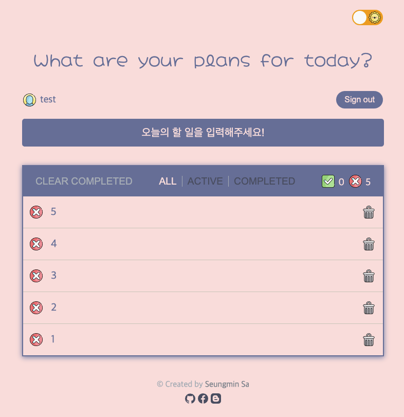

## 🦄 ToDo Application created using Recoil and React

### WIP!! [TS기반으로 마이그레이션 중](https://github.com/saseungmin/Recoil_ToDo/issues/91)

<a href="https://github.com/saseungmin/Recoil_ToDo/actions/workflows/ci.yml">
  
</a>

<a href="https://github.com/saseungmin/Recoil_ToDo/actions/workflows/cd.yml">
  
</a>

<a href="https://codecov.io/gh/saseungmin/Recoil_ToDo">
  
</a>

<a href="https://dashboard.cypress.io/projects/o6z7cm/runs">
  
</a>

<a href="https://github.com/saseungmin/Recoil_ToDo/issues">
  
</a>

<a href="https://github.com/saseungmin/Recoil_ToDo/blob/main/LICENSE"> 
  
</a>

### 🚀 Demo URL
- [Github Page](https://saseungmin.github.io/Recoil_ToDo/)
- [Demo Image](#-demo)
  - Theme (light, dark)
  - Desktop, Mobile

### 🎈 Introduce
- 이 프로젝트는 React의 상태 관리 라이브러리인 **[Recoil](https://recoiljs.org/)를 배우기 위한** 목적으로 만들어졌습니다.
- 그로 인해 간단하게 To-Do List를 만드는 것으로 목표로 잡고 시작하였으며, 더 나아가 Recoil을 사용했을때 어떻게 API 통신하는지 배우고 싶어서 백앤드도 같이 구현하였습니다.
- Recoil 사용에 있어서 미숙한 점이 많아 공식 문서와 여러 커뮤니티 및 [Recoil Github Issue](https://github.com/facebookexperimental/Recoil/issues)를 참고하였습니다.
- TDD 사이클을 완벽하게 지켰다고는 못하지만, 지키려고 노력하며 구현하였습니다.

### 👉 Back-End Repository
- https://github.com/saseungmin/Recoil_Todo_Backend

### 🔥 기술 스택 및 사용 라이브러리
- React
- Recoil
- Emotion
- Axios
- Lodash
- universal-cookie
- Jest, React-Testing-Library, Cypress
- Webpack, Eslint, Babel

### 🐶 Project Structure

```
📦 src
 ┣ 📂 assets
 ┃ ┣ 📂 css
 ┃ ┗ 📂 icons
 ┣ 📂 components
 ┃ ┣ 📂 auth
 ┃ ┣ 📂 common
 ┃ ┣ 📂 footer
 ┃ ┣ 📂 info-bar
 ┃ ┣ 📂 input
 ┃ ┣ 📂 todo
 ┃ ┗ 📂 user-info
 ┣ 📂 hooks
 ┣ 📂 recoil
 ┃ ┣ 📂 auth
 ┃ ┣ 📂 common
 ┃ ┣ 📂 todos
 ┃ ┗ 📂 user
 ┣ 📂 services
 ┃ ┣ 📂 api
 ┣ 📂 styles
 ┣ 📂 utils
 ┃ ┣ 📂 constants
 ┃ ┣ 📂 recoil
 ┣ 📜 App.jsx
 ┣ 📜 App.test.jsx
 ┗ 📜 index.jsx
```


### 🛠 Project Settings

#### 📢 Install dependencies

```bash
> yarn install
```

#### 📢 Start Dev Server

```bash
> yarn start
```

#### 📢 Tests with Jest
- test

```bash
> yarn test
```

- test watch

```bash
> yarn run test:watch
```

- Run test with Code Coverage

```bash
> yarn run coverage
```

#### 📢 Build project

```bash
> yarn run build
```

#### 📢 Check Lint

```bash
> yarn run lint
```

#### 📢 Deploy to Github Pages
- However, I used Github Actions for Continuous Delivery

```bash
> yarn run deploy
```

### 🤔 추가적인 Issue 사항과 고민해볼점
- [Recoil를 사용한 ToDo 리스트 만들기에 대한 구성 사항](https://github.com/saseungmin/Recoil_ToDo/issues/4)
- [Recoil selector와 selectorFamily의 Cache로 인한 문제점](https://github.com/saseungmin/Recoil_ToDo/issues/57)
- [JWT 토큰과 쿠키에 대한 해결 방안](https://github.com/saseungmin/Recoil_ToDo/issues/57)

### 💻 Demo
- Theme

&nbsp;


- Desktop


- mobile


## 🐛 Bug reporting
[Issues](https://github.com/saseungmin/Recoil_ToDo/issues?q=is%3Aissue+is%3Aopen+sort%3Aupdated-desc)

## 🔒 LICENSE
This Project is [MIT licensed](https://github.com/saseungmin/Recoil_ToDo/blob/main/LICENSE).
