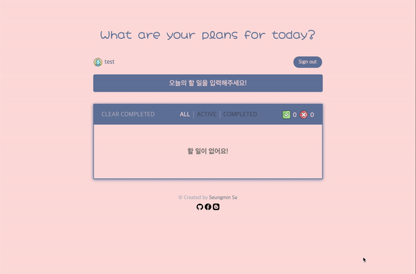

## 🦄 ToDo Application created using Recoil and React

<a href="https://github.com/saseungmin/Recoil_ToDo/actions?query=workflow%3ACI">
  
</a>

<a href="https://github.com/saseungmin/Recoil_ToDo/actions?query=workflow%3ACD">
  
</a>

<a href="https://codecov.io/gh/saseungmin/Recoil_ToDo">
  
</a>
    
<a href="https://github.com/saseungmin/Recoil_ToDo/issues">
  
</a>

<a href="https://github.com/saseungmin/Recoil_ToDo/blob/main/LICENSE"> 
  
</a>

### 🚀 Demo URL
- [Github Page](https://saseungmin.github.io/Recoil_ToDo/)
- [Demo Image](#-demo)


### 🎈 Introduce
- 이 프로젝트는 React의 상태 관리 라이브러리인 **[Recoil](https://recoiljs.org/)를 배우기 위한** 목적으로 만들어졌습니다.
- 그로 인해 간단하게 To-Do List를 만드는 것으로 목표로 잡고 시작하였으며, 더 나아가 Recoil을 사용했을때 어떻게 API 통신하는지 배우고 싶어서 백앤드도 같이 구현하였습니다.
- Recoil 사용에 있어서 미숙한 점이 많아 공식 문서와 여러 커뮤니티 및 [Recoil Github Issue](https://github.com/facebookexperimental/Recoil/issues)를 참고하였습니다.
- TDD 사이클을 완벽하게 지켰다고는 못하지만, 지키려고 노력하며 구현하였습니다.

### 👉 Back-End Repository
- https://github.com/saseungmin/Recoil_Todo_Backend

### 🔥 기술 스택 및 사용 라이브러리
- React
- Recoil
- Emotion
- Axios
- Lodash
- universal-cookie
- Jest, React-Testing-Library
- Webpack, Eslint, Babel

### 🛠 Project Settings

#### 📢 Install dependencies

```bash
> npm install
```

#### 📢 Start Dev Server

```bash
> npm start
```

#### 📢 Tests with Jest
- test

```bash
> npm test
```

- test watch

```bash
> npm run test:watch
```

- Run test with Code Coverage

```bash
> npm run coverage
```

#### 📢 Build project

```bash
> npm run build
```

#### 📢 Check Lint

```bash
> npm run lint
```

#### 📢 Deploy to Github Pages
- However, I used Github Actions for Continuous Delivery

```bash
> npm run deploy
```

### 🤔 추가적인 Issue 사항과 고민해볼점
- [Recoil를 사용한 ToDo 리스트 만들기에 대한 구성 사항](https://github.com/saseungmin/Recoil_ToDo/issues/4)
- [Recoil selector와 selectorFamily의 Cache로 인한 문제점](https://github.com/saseungmin/Recoil_ToDo/issues/57)
- [JWT 토큰과 쿠키에 대한 해결 방안](https://github.com/saseungmin/Recoil_ToDo/issues/57)

### 💻 Demo
- Desktop



- mobile


